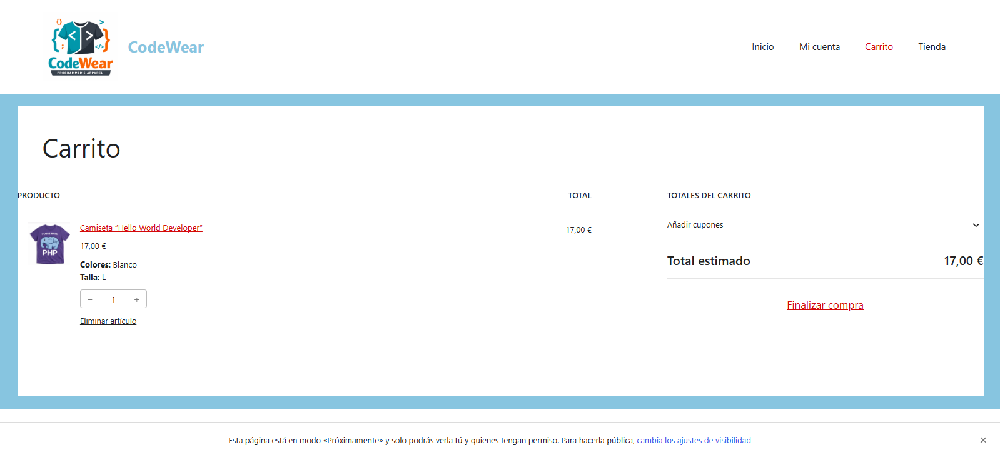

💻 CodeWear
CodeWear es una tienda online especializada en ropa y complementos diseñados exclusivamente para programadores, desarrolladores y entusiastas de la tecnología. Desde camisetas con sintaxis perfecta hasta accesorios que gritan "compila a la primera", CodeWear es el lugar donde el estilo se encuentra con el stack tecnológico.

🛠️ Herramientas utilizadas
El sitio ha sido construido utilizando las herramientas más robustas y flexibles del ecosistema WordPress para garantizar rendimiento y escalabilidad:

Core: WordPress

E-commerce: WooCommerce (Gestión de inventario, pasarela de pagos y pedidos).
    -La página de finalizar compras y carritos se creó con WooCommerce.

Tema Base: GeneratePress (Ligero, rápido y optimizado para SEO).

Maquetación Visual: Elementor (Diseño Drag & Drop personalizado).
    -La página de inicio se creó y se diseño enteramente con Elementor

🔌 Plugins Adicionales
Para potenciar la funcionalidad y el diseño, hemos integrado:

Templately: Para la gestión de plantillas y nubes de diseño.

Essential Addons for Elementor: Widgets avanzados para mejorar la experiencia de usuario.

Essential Blocks: Bloques adicionales de Gutenberg para secciones de contenido dinámico.

✨ Características Principales
-Visualización limpia de productos (camisetas, sudaderas, tazas, etc.).

-Información técnica, guías de tallas y descripción.

-Selección intuitiva de tallas y colores con actualización de stock en tiempo real.

-Proceso de compra fluido gracias a la integración nativa con WooCommerce.

-Totalmente adaptado para que puedas comprar tus "assets" físicos desde el móvil o el escritorio.

🚀 Instalación y Configuración (Resumen)
Requisitos: Servidor con PHP 7.4+ y MySQL 5.7+.

Instalación de WP: Instalar WordPress en el directorio raíz.

Activar Tema: Instalar y activar GeneratePress.

Plugins Necesarios:

Instalar WooCommerce y seguir el asistente de configuración.

Instalar Elementor y los addons mencionados anteriormente.

Importación de Contenido: (Opcional) Usar Templately para importar los layouts prediseñados de la tienda.

💭 Lo que me ha aportado hacer este proyecto
-Aprender a utilizar Elementor y WooCommerce

-Mejora en el diseño de interfaces

-Mejor manejo de la interfaz de WordPress

